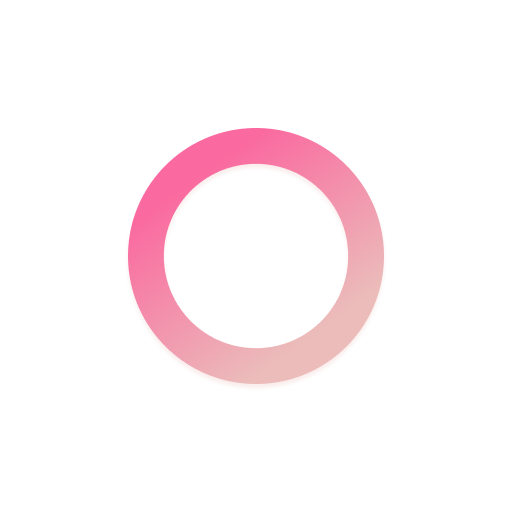
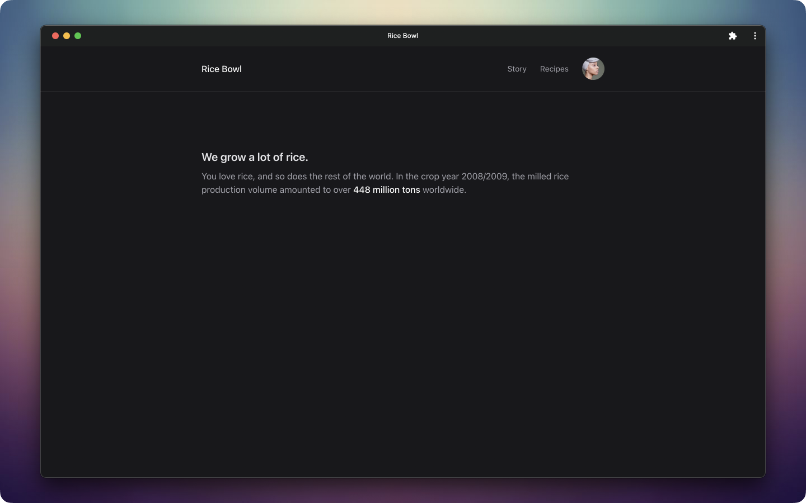
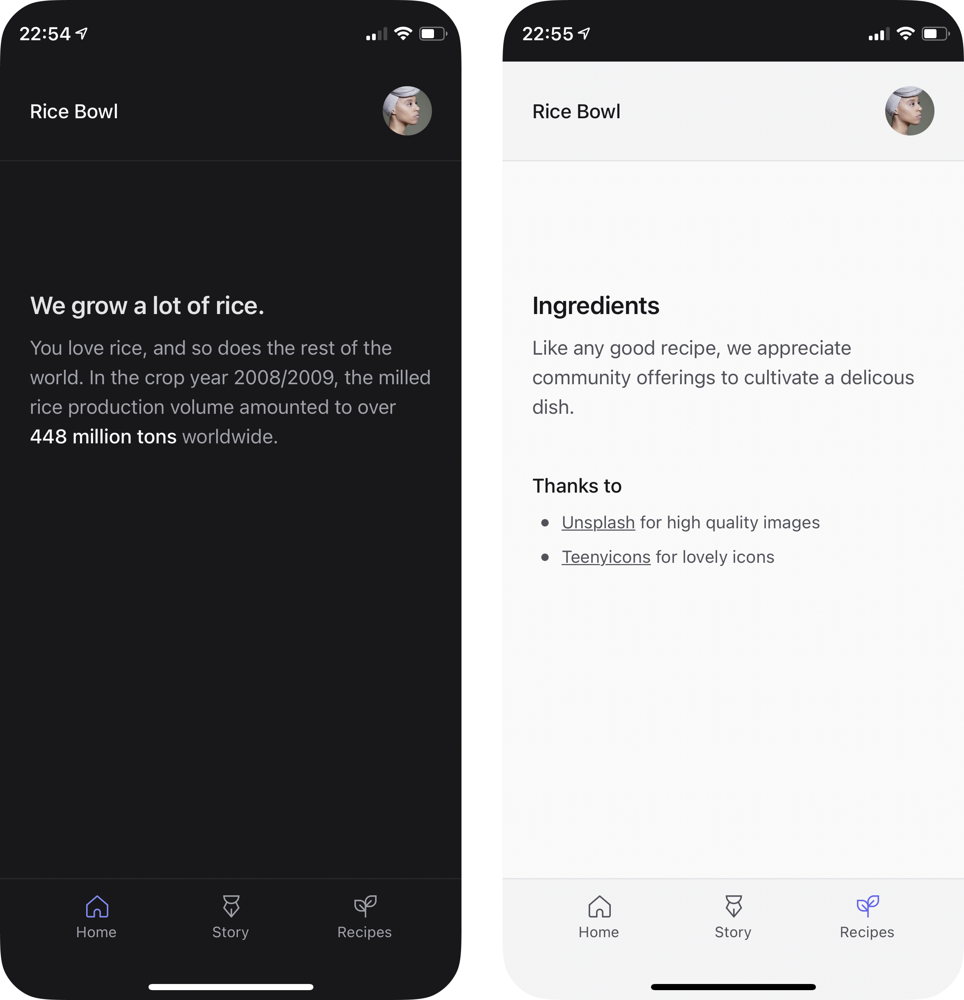

	
	<h2 align="center">Next PWA Template</h2>

Fluffless app template to inspire less

	<a href="https://next-pwa-template.now.sh">Live demo</a>

	
	

## Features

- ✨ Fluffless PWA using Next 12
- 🌗 Lovely night/day themes
- 🦄 Easily removable [nice-to-haves](#use-only-what-you-need)
- 📱 Native-like mobile experience
- 📦 Neatly wrapped like that avocado you got for christmas

## Getting started

1. [Use this template](https://github.com/mvllow/next-pwa-template/generate)
2. Replace `public/images` with your own
3. Enjoy ✨

## Use only what you need

Fluffless doesn't mean "start with nothing". The goal of this template is to be an entry into maintainable apps.

**The essentials**

- Typescript, made easy with Next.js
- [tailwindcss](https://github.com/tailwindlabs/tailwindcss) for utility-first styling
- [next-pwa](https://github.com/shadowwalker/next-pwa) for offline support

**Nice to haves**

- [next-themes](https://github.com/pacocoursey/next-themes) or similar for low stress theming

## Gallery

### Desktop

### Mobile

