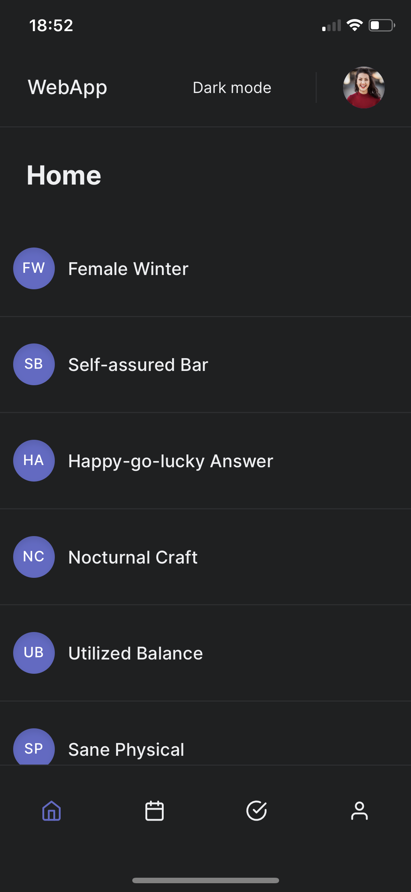
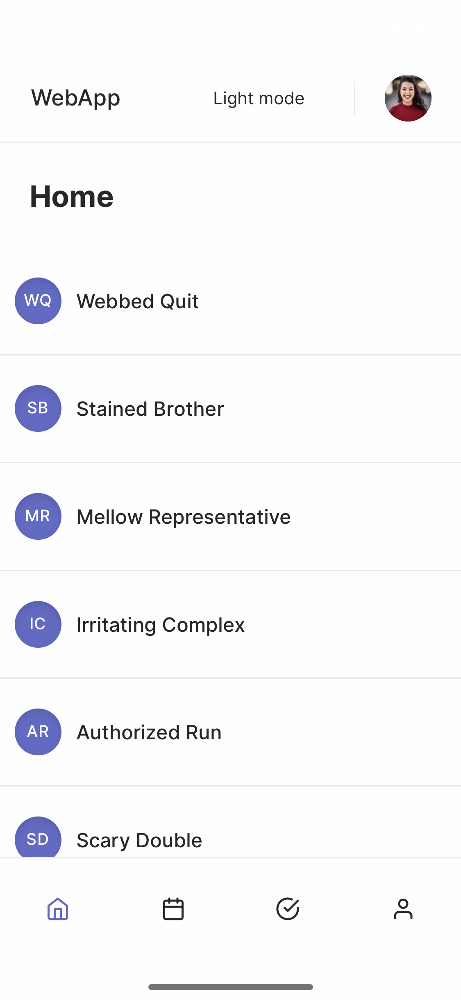
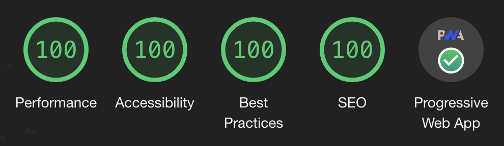

# Next PWA Template

> I am happy to slim or bulk up the template depending on needs. Does sample data help? Hurt? Let me know!

   

## Features

- PWA ready
- Dark mode 🌚
- Eslint/prettier working with typescript
- 100% lighthouse scores

## Known issues

- App icon transparency is made black on iOS homescreen (easy fix is to use a non-circle icon for apple and match their dimensions)
- Statusbar is unreadable in light mode
- Yes, the title is ultra hacky and should probably be rewritten

## pwacompat

A quick solution for the below is [pwacompat](https://github.com/GoogleChromeLabs/pwacompat). At the time of writing, 20 splash screen images are needed for apple devices alone (portrait and orientation for all screen sizes).

- Needs apple splash screen images and meta tags
- Web manifest/meta tags could probably be optimised? More icon sizes maybe?
